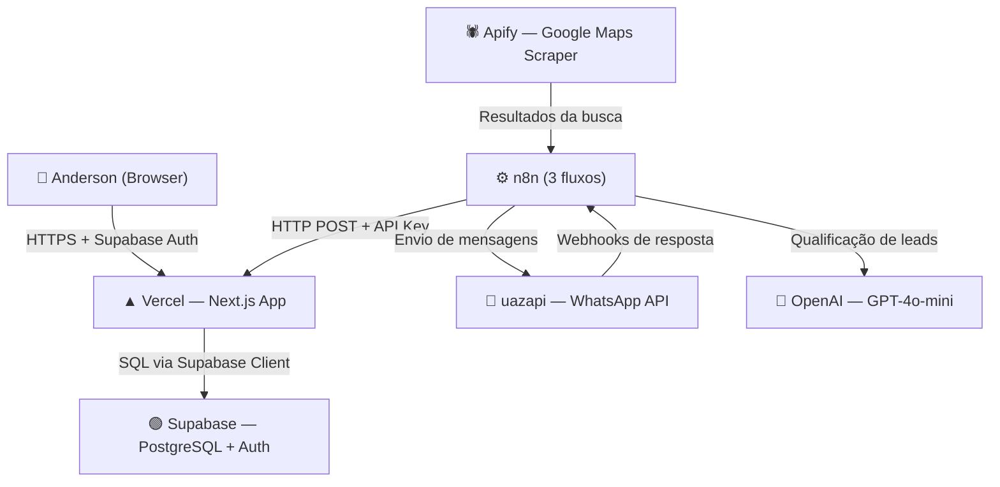
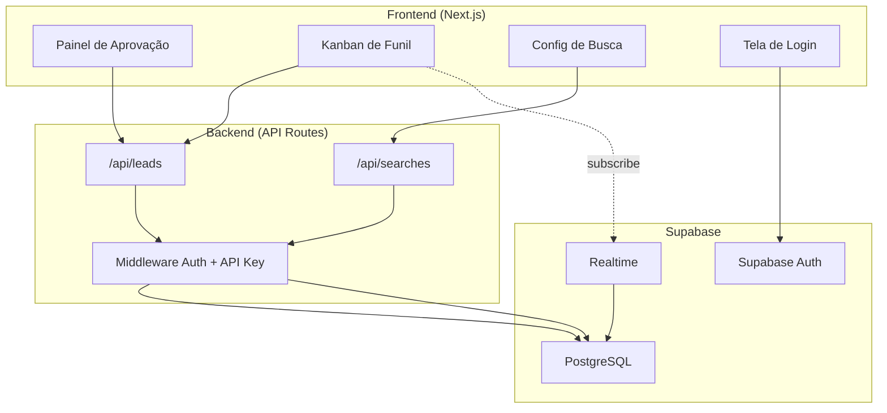
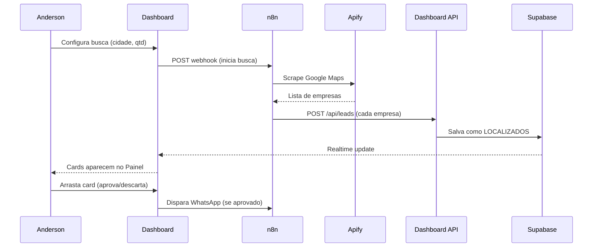
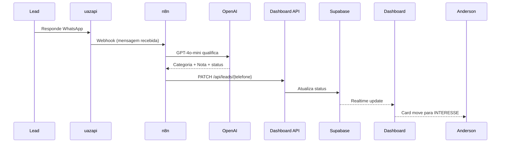

# 4g_project — Fullstack Architecture Document

## Change Log

| Data | Versão | Descrição | Autor |
|------|--------|-----------|-------|
| 2026-04-15 | 1.0 | Criação inicial | Aria (Architect) |

---

## 1. Introdução

Este documento define a arquitetura completa do **4g_project** — um dashboard web interativo que substitui o Google Sheets no gerenciamento do funil de prospecção de leads da 4G. Serve como fonte única de verdade para o desenvolvimento, cobrindo frontend, backend, banco de dados e integrações externas.

**Starter Template:** N/A — Projeto Greenfield. Ponto de partida: `create-next-app` com TypeScript + Tailwind CSS.

---

## 2. Arquitetura de Alto Nível

### Resumo Técnico

O 4g_project é uma aplicação web monolítica construída com Next.js 14+ (App Router), servindo tanto o frontend (React + Tailwind) quanto o backend (API Routes). O Supabase fornece o banco de dados PostgreSQL e a autenticação, eliminando a necessidade de um servidor separado. O deploy ocorre na Vercel com distribuição global via CDN. Os 3 fluxos n8n existentes comunicam-se com a aplicação via HTTP (API Routes protegidas por API key), substituindo o Google Sheets como fonte da verdade.

### Plataforma e Infraestrutura

**Plataforma:** Vercel + Supabase

**Serviços:**
- **Vercel** — Deploy do Next.js, CDN global, preview deployments automáticos
- **Supabase** — PostgreSQL, Auth, Realtime (atualizações automáticas do Kanban)

**Deploy e Regiões:** Vercel Edge Network (global) + Supabase South America (sa-east-1)

### Estrutura do Repositório

**Monorepo simples** — sem ferramentas adicionais (Turborepo/Nx). Next.js + Supabase em um único projeto.

### Diagrama de Arquitetura



### Padrões Arquiteturais

- **Jamstack + API Routes:** Frontend estático + serverless functions — ideal para Vercel, sem servidor dedicado
- **Server Components (React):** Páginas renderizadas no servidor para carregamento rápido do Kanban
- **Repository Pattern:** Camada de acesso ao banco abstraída — facilita testes e futura troca de DB
- **Webhook Pattern:** n8n comunica-se com o dashboard via HTTP POST — desacoplamento total entre automação e UI
- **Realtime Subscriptions:** Supabase Realtime atualiza o Kanban automaticamente quando n8n grava novos dados

---

## 3. Tech Stack

| Categoria | Tecnologia | Versão | Propósito | Racional |
|-----------|-----------|--------|-----------|----------|
| Frontend Language | TypeScript | 5.x | Tipagem estática | Previne erros em runtime |
| Frontend Framework | Next.js | 14+ | App Router + SSR | Full-stack em um projeto, deploy fácil na Vercel |
| UI Component Library | shadcn/ui | latest | Componentes prontos | Acessíveis, customizáveis, sem custo |
| Drag & Drop | @dnd-kit | 6.x | Kanban + swipe cards | Leve, acessível, suporte mobile |
| State Management | Zustand | 4.x | Estado global | Simples, sem boilerplate |
| Backend Framework | Next.js API Routes | 14+ | Endpoints REST | Sem servidor separado, serverless na Vercel |
| API Style | REST | — | Comunicação n8n ↔ dashboard | Simples, compatível com n8n HTTP nodes |
| Banco de Dados | PostgreSQL (Supabase) | 15.x | Fonte da verdade | Substitui Google Sheets, gratuito |
| Realtime | Supabase Realtime | latest | Kanban auto-atualiza | Sem WebSockets manuais |
| Autenticação | Supabase Auth | latest | Login email + senha | Integrado ao banco |
| Frontend Testing | Vitest + Testing Library | latest | Testes de componentes | Rápido, integrado ao Next.js |
| Backend Testing | Vitest | latest | Testes das API Routes | Consistência com frontend |
| E2E Testing | Playwright | latest | Fluxo crítico de aprovação | Testa swipe + Kanban no browser |
| CI/CD | GitHub Actions | — | Deploy automático | Gratuito, integrado ao Vercel |
| Monitoring | Vercel Analytics | gratuito | Performance e erros | Zero config |
| CSS Framework | Tailwind CSS | 3.x | Estilização | Rápido, consistente |

---

## 4. Modelos de Dados

### Lead

**Propósito:** Representa cada empresa no funil, do momento em que é encontrada até o handoff ao Anderson como Closer.

```typescript
interface Lead {
  id: string;                    // UUID
  empresa: string;               // Nome da empresa
  telefone: string;              // E.164 (chave de idempotência)
  website?: string;
  cidade?: string;
  estado?: string;
  pais?: string;
  status: LeadStatus;
  categoria?: 'DOMÉSTICOS' | 'ESPORTIVOS' | 'MISTO';
  nota?: number;                 // 0-10, score da IA
  data_coleta: Date;
  data_resposta?: Date;
  data_followup?: Date;
  qtd_reengajamentos: number;
  search_id?: string;            // Referência à busca que gerou o lead
  created_at: Date;
  updated_at: Date;
}

type LeadStatus =
  | 'LOCALIZADOS'    // Encontrado pelo Apify, aguardando aprovação
  | 'PROSPECTAR'     // Aprovado, aguardando disparo do WhatsApp
  | 'PROSPECTADOS'   // WhatsApp enviado, follow-ups em curso
  | 'INTERESSE'      // Qualificado pela IA, aguardando handoff
  | 'TRANSFERIDOS'   // Handoff ao Closer (Anderson) concluído
  | 'DESCARTADOS';   // Rejeitado / bot / sem WhatsApp / opt-out
```

### Search

**Propósito:** Registra cada sessão de busca configurada pelo Anderson.

```typescript
interface Search {
  id: string;
  pais: string;
  estado: string;
  cidade: string;
  quantidade: number;             // 1-100
  status: 'PENDENTE' | 'CONCLUÍDA' | 'ERRO';
  total_encontrados?: number;
  created_at: Date;
}
```

---

## 5. API REST

### Autenticação

| Quem chama | Método | Header |
|-----------|--------|--------|
| Anderson (browser) | Supabase Auth | Cookie de sessão |
| n8n (automação) | API Key | `x-api-key: {secret}` |

### Endpoints

| Método | Endpoint | Quem chama | Descrição |
|--------|----------|-----------|-----------|
| `GET` | `/api/leads` | Frontend | Lista leads com filtro por status |
| `POST` | `/api/leads` | n8n + Frontend | Cria novo lead |
| `PATCH` | `/api/leads/[telefone]` | n8n + Frontend | Atualiza status/categoria/nota |
| `PATCH` | `/api/leads/bulk-approve` | Frontend | Aprova todos os LOCALIZADOS |
| `GET` | `/api/searches` | Frontend | Histórico de buscas |
| `POST` | `/api/searches` | Frontend | Inicia nova busca (aciona n8n) |
| `PATCH` | `/api/searches/[id]` | n8n | Atualiza status da busca |

### Exemplos de Payload

```json
// n8n envia empresa encontrada
POST /api/leads
x-api-key: {secret}
{
  "empresa": "Loja do João",
  "telefone": "5511999998888",
  "cidade": "São Paulo",
  "estado": "SP",
  "pais": "Brasil",
  "search_id": "uuid-da-busca"
}

// n8n atualiza lead qualificado
PATCH /api/leads/5511999998888
x-api-key: {secret}
{
  "status": "INTERESSE",
  "categoria": "DOMÉSTICOS",
  "nota": 8
}

// Frontend aprova todos
PATCH /api/leads/bulk-approve
Cookie: session
{}
```

---

## 6. Componentes do Sistema



---

## 7. Workflows Principais

### Workflow 1 — Busca e Aprovação



### Workflow 2 — Qualificação pelo n8n



---

## 8. Schema do Banco de Dados

```sql
-- Tabela de buscas
CREATE TABLE searches (
  id UUID PRIMARY KEY DEFAULT gen_random_uuid(),
  pais TEXT NOT NULL,
  estado TEXT NOT NULL,
  cidade TEXT NOT NULL,
  quantidade INTEGER NOT NULL CHECK (quantidade BETWEEN 1 AND 100),
  status TEXT NOT NULL DEFAULT 'PENDENTE'
    CHECK (status IN ('PENDENTE', 'CONCLUÍDA', 'ERRO')),
  total_encontrados INTEGER DEFAULT 0,
  created_at TIMESTAMPTZ DEFAULT NOW()
);

-- Tabela de leads
CREATE TABLE leads (
  id UUID PRIMARY KEY DEFAULT gen_random_uuid(),
  empresa TEXT NOT NULL,
  telefone TEXT NOT NULL UNIQUE,
  website TEXT,
  cidade TEXT,
  estado TEXT,
  pais TEXT,
  status TEXT NOT NULL DEFAULT 'LOCALIZADOS'
    CHECK (status IN (
      'LOCALIZADOS','PROSPECTAR','PROSPECTADOS',
      'INTERESSE','TRANSFERIDOS','DESCARTADOS'
    )),
  categoria TEXT CHECK (categoria IN ('DOMÉSTICOS','ESPORTIVOS','MISTO')),
  nota SMALLINT CHECK (nota BETWEEN 0 AND 10),
  data_coleta TIMESTAMPTZ DEFAULT NOW(),
  data_resposta TIMESTAMPTZ,
  data_followup TIMESTAMPTZ,
  qtd_reengajamentos SMALLINT DEFAULT 0,
  search_id UUID REFERENCES searches(id),
  created_at TIMESTAMPTZ DEFAULT NOW(),
  updated_at TIMESTAMPTZ DEFAULT NOW()
);

-- Indexes
CREATE INDEX idx_leads_status ON leads(status);
CREATE INDEX idx_leads_telefone ON leads(telefone);
```

---

## 9. Estrutura do Projeto

```
4g_project/
├── src/
│   ├── app/
│   │   ├── (auth)/
│   │   │   └── login/page.tsx
│   │   ├── (dashboard)/
│   │   │   ├── aprovacao/page.tsx
│   │   │   ├── kanban/page.tsx
│   │   │   └── layout.tsx
│   │   └── api/
│   │       ├── leads/
│   │       │   ├── route.ts
│   │       │   ├── [telefone]/route.ts
│   │       │   └── bulk-approve/route.ts
│   │       └── searches/
│   │           ├── route.ts
│   │           └── [id]/route.ts
│   ├── components/
│   │   ├── ui/                  # shadcn/ui
│   │   ├── kanban/              # KanbanBoard, KanbanColumn, LeadCard
│   │   └── approval/            # ApprovalCard, SwipeCard, BulkApprove
│   ├── lib/
│   │   ├── supabase/            # Cliente browser + server
│   │   ├── api/                 # Funções de acesso à API
│   │   └── middleware.ts        # Auth + API Key validation
│   └── types/
│       └── index.ts             # Lead, Search, LeadStatus
├── supabase/
│   └── migrations/              # SQL migrations
├── docs/
│   ├── brief.md
│   ├── prd.md
│   └── architecture.md
├── .env.example
└── package.json
```

---

## 10. Ambiente e Deploy

### Variáveis de Ambiente

```bash
# Supabase
NEXT_PUBLIC_SUPABASE_URL=
NEXT_PUBLIC_SUPABASE_ANON_KEY=
SUPABASE_SERVICE_ROLE_KEY=

# Integração n8n
N8N_API_KEY=           # Chave que o n8n usa para acessar a API
N8N_WEBHOOK_URL=       # URL do webhook n8n para iniciar buscas
```

### Ambientes

| Ambiente | URL | Propósito |
|---------|-----|-----------|
| Development | localhost:3000 | Desenvolvimento local |
| Production | 4g-project.vercel.app | Produção |

### CI/CD

- Push no GitHub → GitHub Actions → Deploy automático na Vercel
- Migrations Supabase aplicadas manualmente antes do deploy

---

## 11. Segurança

- Todas as rotas do dashboard bloqueadas sem sessão Supabase válida
- Endpoints do n8n bloqueados sem `x-api-key` válida no header
- CORS restrito ao domínio do dashboard
- `SUPABASE_SERVICE_ROLE_KEY` e `N8N_API_KEY` nunca expostos ao browser
- Validação de input em todos os endpoints (telefone E.164, status enum, nota 0-10)

---

## 12. Testes

**Foco nos fluxos críticos:**
- Login e proteção de rotas
- Aprovação individual por swipe
- Aprovação em lote (bulk-approve)
- PATCH de status pelo n8n (idempotência por telefone)
- Drag & drop entre colunas do Kanban

**Estrutura:**
```
src/
├── components/
│   └── __tests__/        # Vitest + Testing Library
└── app/api/
    └── __tests__/        # Vitest (API Routes)

e2e/
└── approval.spec.ts      # Playwright (fluxo completo)
```

---

## 13. Padrões de Código

- **Tipos compartilhados:** sempre em `src/types/index.ts` — nunca duplicar
- **Acesso ao banco:** sempre via `src/lib/supabase/` — nunca chamar Supabase direto nos componentes
- **Status de leads:** sempre via `LeadStatus` enum — nunca strings avulsas
- **API calls no frontend:** sempre via `src/lib/api/` — nunca `fetch` direto nos componentes
- **Variáveis de ambiente:** nunca `process.env` diretamente — usar objeto de config centralizado

### Convenções de Nomenclatura

| Elemento | Padrão | Exemplo |
|----------|--------|---------|
| Componentes React | PascalCase | `LeadCard.tsx` |
| Hooks | camelCase com `use` | `useLeads.ts` |
| API Routes | kebab-case | `/api/bulk-approve` |
| Tabelas do banco | snake_case | `leads`, `searches` |
| Variáveis | camelCase | `leadStatus` |

---

## 14. Tratamento de Erros

```typescript
// Formato padrão de erro da API
interface ApiError {
  error: {
    code: string;      // Ex: 'LEAD_NOT_FOUND', 'INVALID_STATUS'
    message: string;   // Mensagem legível
    timestamp: string;
  };
}

// Exemplos de códigos de erro
// 401 UNAUTHORIZED — sem sessão ou API key inválida
// 404 LEAD_NOT_FOUND — telefone não existe no banco
// 409 DUPLICATE_LEAD — telefone já cadastrado
// 422 INVALID_STATUS — transição de status inválida
```

---

## 15. Monitoramento

- **Performance:** Vercel Analytics (Core Web Vitals, tempo de carregamento)
- **Erros de API:** Vercel Logs (logs de todas as API Routes)
- **Banco:** Supabase Dashboard (queries lentas, uso de conexões)
- **Meta:** Dashboard carregando em menos de 3 segundos (NFR1)

---

*Documento gerado por Aria (Architect Agent) — 4g_project*
*Versão: 1.0 | Data: 2026-04-15*
